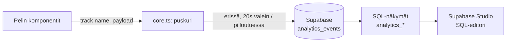

# Analytiikkastrategia — Arojen Tarinat

Käytännönläheinen, yhden kehittäjän mittakaavaan sopiva analytiikka- ja
retentiostrategia. Ei erillistä analytiikka-SaaSia, ei omaa palvelininfraa —
kaikki nojaa jo olemassa olevaan Supabase-projektiin. Lähdekoodi on aina
totuuden lähde; tämä dokumentti selittää *miksi* rakenne on tällainen.

## Periaatteet

1. **Opt-in, ei opt-out.** `src/lib/analytics/consent.ts`: oletus on aina
   "ei suostumusta". Ilman eksplisiittistä hyväksyntää (`AnalyticsConsentBanner.tsx`
   tai asetusvalikko) mitään ei puskuroida edes paikallisesti eikä lähetetä.
2. **Ei PII:tä koskaan.** Vain satunnainen, ei-identifioiva `clientId`
   (`crypto.randomUUID()`, ei laitetunnistetta, ei sähköpostia/nimeä).
3. **Yksinkertainen putki riittää.** `track()` puskuroi paikallisesti ja
   lähettää eriä Supabaseen (`analytics_events`-taulu) — ei reaaliaikaista
   striimiä, ei viestijonoa. Katso `src/lib/analytics/core.ts`.
4. **Datavetoinen, ei arvailtu.** Kaikki tähän dokumenttiin viittaavat
   päätökset (vaikeustason säätö, talouden tasapaino, hylätyt ominaisuudet)
   perustuvat oikeisiin `analytics_events`-tauluun kertyviin lukuihin, ei
   oletuksiin.

## Arkkitehtuuri

- **Tapahtumataksonomia**: `src/lib/analytics/types.ts` (`AnalyticsEventPayloadMap`)
  — yksi paikka joka listaa jokaisen tapahtuman ja sen täsmällisen payloadin.
  `track()` on täysin tyypitetty tämän ympärille: väärä payload-muoto on
  TS-käännösvirhe, ei runtime-bugi.
- **Taulu + RLS**: `supabase/migrations/20260919150000_create_analytics_events.sql`.
  Anon-avain saa vain `INSERT`in itselleen — ei `SELECT`/`UPDATE`/`DELETE`-
  policya lainkaan, joten RLS:n oletusarvoinen "deny" estää sekä muiden
  pelaajien datan lukemisen että minkään rivin muokkaamisen/poistamisen
  julkisella avaimella. `event_name` on rajattu CHECK-constraintilla täsmälleen
  `types.ts`:n unioniin (roskadatan esto).
- **Dashboardit ovat SQL-näkymiä**, ei erillistä admin-frontendia (ylimitoitettu
  yhdelle kehittäjälle): `analytics_daily_active_users`, `analytics_session_lengths`,
  `analytics_retention_cohorts`, `analytics_achievement_unlock_rates`,
  `analytics_campaign_outcomes`, `analytics_battle_balance`,
  `analytics_feature_usage`, `analytics_economy_health` — kaikki
  `security_invoker = true` ja ilman anon/authenticated-oikeuksia, joten ne
  näkyvät vain Supabase Studion SQL-editorissa (service-rooli/omistaja).
  Katsele niitä siellä säännöllisesti sen sijaan että rakentaisit oman
  dashboard-UI:n.

## Tapahtumasuunnitelma (event tracking plan)

| Tapahtuma | Miksi | Missä lähetetään |
|---|---|---|
| `session_start`/`session_end` | istunnon pituus, DAU, D1/D7/D30 | `core.ts` (`startSession`/`endSession`, näkyvyys-/sulkemiskuuntelijat) |
| `onboarding_step` | tutoriaalin puuttuessa: de facto -onboarding-suppilo | ProvinceGame.tsx + useAchievementTracking.ts (faction_select_viewed → faction_chosen → turn_1 → turn_5 → first_battle → first_building) |
| `game_start`/`game_over`/`campaign_restart` | kampanjan läpäisyaste, syyt keskeytyksiin | ProvinceGame.tsx / useAchievementTracking.ts |
| `game_saved`/`game_loaded` | kuinka paljon tallennusjärjestelmää käytetään | useSaveManager.ts |
| `progression_snapshot` | vaikeuspiikit, pudokaskohdat, talouden tasapaino (treasury-delta ikkunafunktiolla, ei erillistä per-tick-tapahtumaa) | useAchievementTracking.ts (kerran/vuoro) |
| `battle_outcome` | taistelutasapaino, turhauttavat mekaniikat | useAchievementTracking.ts (pendingBattle) |
| `building_constructed`/`army_recruited`/`card_played` | mitä järjestelmiä pelataan vs. jätetään käyttämättä | useAchievementTracking.ts (gameState-diffi) |
| `treaty_proposed`/`treaty_broken`/`war_declared` | diplomatiajärjestelmän käyttöaste | useAchievementTracking.ts |
| `achievement_unlocked` | avausaste, aika-avaukseen, harvinaisuus | useAchievementTracking.ts (`checkAndUnlock`) |
| `menu_interaction`/`settings_changed` | UX-kitka, ominaisuuksien löydettävyys | ProvinceGame.tsx / SettingsMenu.tsx |
| `experiment_assigned` | A/B-testaus | experiments.ts (`assignVariant`/`useExperiment`) |

## Retentio & churn

- Paikallinen D1/D7/D30-arvio pelaajakohtaisesti: `retention.ts`
  (`getRetentionSummary`), käyttää `arojen_tarinat_analytics_days_v1`-listaa.
- Oikea, kaikkien pelaajien kattava kohorttiretentio lasketaan palvelimella
  `analytics_retention_cohorts`-näkymästä (ryhmitelty ensimmäisen
  `session_start`-päivän mukaan).
- **Churn-riski** (`retention.ts`, `estimateChurnRisk`) on tietoisesti
  sääntöpohjainen heuristiikka, EI koulutettu ML-malli — yhden kehittäjän
  data-/infra-määrä ei riitä mielekkääseen ML-pipeliniin. Kun pelaajamäärä
  kasvaa, korvaa/tarkenna tämä palvelinpuolen SQL-analyysillä oikeasta
  kohorttidatasta.

## Vaikeustason ja talouden tasapaino

- Ei automaattista adaptiivista vaikeustasoa (ylimitoitettu riski: näkymätön
  "epäreilu" säätö turhauttaa enemmän kuin auttaa). Sen sijaan:
  `analytics_battle_balance` (kumpi puoli voittaa yleisimmin, keskimääräiset
  tappiot) ja `analytics_economy_health` (kultavarannon keskimääräinen
  muutos/vuoro faktion ja vaikeustason mukaan) luetaan manuaalisesti ja
  `VICTORY_TARGETS`/AI-talousmultiplierit (`useProvinceGameState.ts`)
  säädetään käsin datan perusteella — sama malli jota jo käytettiin kun
  talous-/kulttuurivoiton ehtoja kiristettiin (ks. repo-muisti).
- `analytics_achievement_unlock_rates` paljastaa liian helpot (>90% avaus)
  tai liian vaikeat/ei-huomatut (<1%) saavutukset korjattavaksi
  `achievementDefinitions.ts`:ssä.
- `analytics_feature_usage` paljastaa alikäytetyt järjestelmät (esim. jos
  `treaty_proposed` on lähes nolla, diplomatia-UI:ta pitää tehdä
  näkyvämmäksi tai palkitsevammaksi).

## A/B-testaus

`src/lib/analytics/experiments.ts`: deterministinen, pysyvä variantti per
`clientId + experimentKey` (hash, ei uutta arvontaa joka kutsulla). Onnistumista
mitataan jälkikäteen suodattamalla `analytics_events`-taulua
`experiment_assigned`-tapahtuman variantin mukaan ja vertaamalla relevanttia
mittaria (esim. `game_over.won`, `session_end.durationMs`,
`campaign_restart`-määrä) varianttien välillä.

## Eettinen tiedonkäyttö (GDPR)

- Opt-in-oletus, selkeä suomi/englanti-kysely (`AnalyticsConsentBanner.tsx`),
  valinta muutettavissa milloin tahansa asetuksista.
- Ei PII:tä missään tapahtumassa; `forgetClientId()` (consent.ts) poistaa
  paikallisen clientId:n osana "poista tietoni" -polkua.
- Suostumuksen peruuttaminen tyhjentää välittömästi paikallisen puskurin
  (`setAnalyticsConsent(false)`).

## Tunnetut rajoitteet (tietoisia päätöksiä, ei unohdettuja bugeja)

- Ei palvelinpuolista rate-limitointia `analytics_events`-inserteille (vain
  CHECK-constraintit koolle/muodolle). Riittää normaalikäyttöön; jos väärin-
  käyttöä havaitaan, päivitä rate-limitoivaksi edge-funktioksi suoran
  client-insertin sijaan.
- Ei reaaliaikaista dashboardia — data luetaan Supabase Studion SQL-editorista
  tarpeen mukaan, ei jatkuvasti päivittyvää UI:ta.
- Churn-/segmentointimallit ovat sääntöpohjaisia heuristiikkoja, ei ML:ää.

## Roadmap

1. ✅ Tapahtumataksonomia + suostumus + puskurointi + taulu/RLS/näkymät (tämä pass).
2. ✅ Ydintapahtumien kytkentä peliin (istunnot, kampanja, taistelut, talous,
   diplomatia, saavutukset, asetukset).
3. ⏳ Lue näkymiä säännöllisesti pelin julkaisun jälkeen; säädä
   `VICTORY_TARGETS`/AI-multipliereja/saavutusten `estimatedUnlockRate`-arvoja
   oikean datan perusteella.
4. ⏳ Jos pelaajamäärä kasvaa merkittävästi: harkitse rate-limitoivaa edge-
   funktiota suoran client-insertin sijaan, ja/tai kevyt oma
   dashboard-sivu jos SQL-editori käy hankalaksi.
